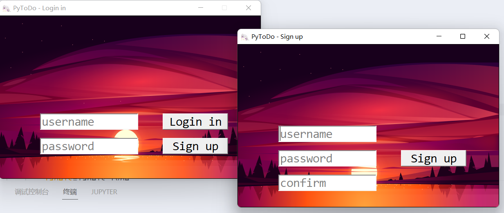
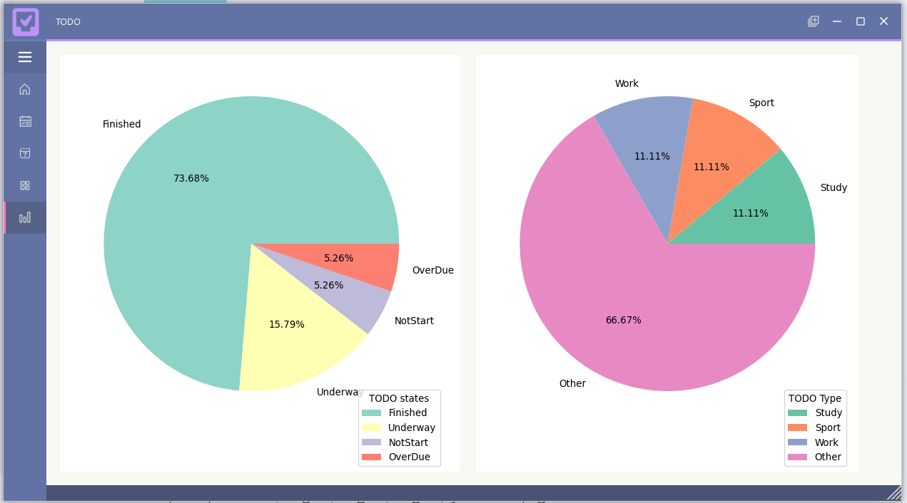

# 《暑期Python课》大作业实验报告


## 一、实验任务

题目4 任务调度器

### 内容

随着大学生活日渐丰富，功课和活动更加交织在一起。因此，我们设计了一个应用程序，帮助规划日常任务，合理记录任务，更好地规划自己的时间。

### 要求

1. 使用GUI库，如TKinter和PyQt5
2. 提供一个工作系统，有包括日历、任务状态区分、历史数据审查、任务安排等简洁清晰功能
3. 界面简洁明了而富有表现，用户可以轻松浏览系统


***


## 二、已完成任务

### 基本实验要求 

1. 支持任务添加系统。用户可以创建新任务，包括标题、内容、截止日期、重要性等；同时，任务允许修改和删除。✔
2. 显示每日任务。支持显示每天需要完成的任务。✔
3. 确认任务的完成。当一项任务完成后，用户可以通过勾选复选框等方法标记该任务已完成。✔
4. 日历系统。提供日历，用户可以通过日历查看一个月中每个日期的任务安排。✔
5. 任务状态的区分。区分未开始、进行中、已完成和已逾期四种任务状态。✔
6. 任务安排。通过任务列表，系统自动组织空闲时间安排任务。✔
7. 用户登陆系统。通过架设在服务器的数据库支持用户登陆系统，并通过数据联网支持用户在任何设备上登陆均可同步自己的所有任务。✔

### 可选要求

1. 待办事项系统根据时间过滤和显示任务。✔
2. 任务类别划分。支持体育、学习、工作和其他四种任务类别。✔
3. 数据收集与分析。通过架设在服务器的数据库，系统可以根据历史任务完成数据进行数据分析。✔
4. 支持日常任务。对于日常任务，只需设置一次，就会自动出现在每天指定时间的任务列表中。✔
5. 加权任务安排。支持重要性等属性量化，通过设置任务清单和任务的重要性，可以自动安排任务计划，同时可以分配空闲时间用于休息。✔

## 三、整体设计方案

将项目初步解耦为`数据库`、`登录系统`、`任务编辑`、`主页面`四个方面，其中`主页面`又细分为`任务过滤页面`、`任务调度页面`、`日历页面`、`四象限规划页面`、`历史记录可视化页面`。

### 3.1 数据库


### 3.2 登录系统

在设计登录系统时，我们采用了大多数软件使用的窗口登录方式——使用单独的窗体进行账户注册与登录，只有在登录成功后才会显示软件主页面。



这里用账户`admin`登录成功后，如下图：


其在主程序中代码如下：

```python
app = QApplication(sys.argv)
loginState, loginuser, tasks=login.loginWindow(app)
window = MainWindow()
if loginState:
sys.exit(app.exec())
else:
sys.exit(1)
```

登录系统作为独立的模块为主程序提供 登录状态(Boolean)、登录用户(User) 和 对应用户存储在数据库中的任务列表(Task[])。

### 3.3 任务编辑


### 3.4 主页面

在主页面中，可以通过左侧选项卡切换至具体页面，在右上角新建任务。


这里，我们在主程序中将主界面各选项卡中的Button控件关联到其对应的页面及相关模块，对任务进行进一步下派：

```python
# LEFT MENUS
widgets.btn_home.clicked.connect(self.buttonClick)
widgets.btn_arrange.clicked.connect(self.buttonClick)
widgets.btn_calendar.clicked.connect(self.buttonClick)
widgets.btn_matrix.clicked.connect(self.buttonClick)
widgets.btn_pic.clicked.connect(self.buttonClick)

def buttonClick(self):
    # GET BUTTON CLICKED
    btn = self.sender()
    btnName = btn.objectName()

    # SHOW HOME PAGE
    if btnName == "btn_home":
    widgets.stackedWidget.setCurrentWidget(widgets.home)
    self.showTodo('All')

    # SHOW WIDGETS PAGE
    if btnName == "btn_arrange":
    widgets.stackedWidget.setCurrentWidget(widgets.arrange_page)
    self.arrange_showList()

    # SHOW CALENDAR PAGE
    if btnName == "btn_calendar":
    widgets.stackedWidget.setCurrentWidget(widgets.calendar_page)  # SET PAGE
    from mycalendar import refresh_calendar
    refresh_calendar()

    # SHOW MATRIX PAGE
    if btnName == "btn_matrix":
    widgets.stackedWidget.setCurrentWidget(widgets.matrix_page)  # SET PAGE
    from mymatrix import matrix_refresh
    matrix_refresh()

    if btnName == "btn_pic":
    widgets.stackedWidget.setCurrentWidget(widgets.pic_page)  # SET PAGE
    from ui_pic import pic_page_refresh
    pic_page_refresh(widgets)

    UIFunctions.resetStyle(self, btnName)  # RESET ANOTHERS BUTTONS SELECTED
    btn.setStyleSheet(UIFunctions.selectMenu(btn.styleSheet()))  # SELECT MENU
```

这样就可以将为每个页面分别撰写的代码（./ui_*.py）拼接在主页面中了。

在日历和四象限页面中，我们采用窗格的形式显示单个任务，将页面布局进行多次纵向、横向划分，从而将单个建模的任务窗格延展到整个页面。在日历中，我们可以通过`Last`和`Next`两个按钮进行月份切换，查看各月份的整体任务情况。


在进行数据分析时，我们使用`matplotlib`库进行数据可视化，将数据库中的数据同步到本地，再对数据进行处理，并拼接所绘制的图片。



## 四、创新之处

### 1. PySide6 & PyQt6

### 2. 时间四象限

我们使使用了由美国管理学家科维提出的时间四象限法进行时间管理，将任务按紧急与重要两个维度进行分类，便于用户做出进一步的时间管理。

具体来说，我们为每个任务设置了重要性作为可选参数，并根据任务的截止时间与当前时间的差距进行紧急性判断，这就是四象限的实现逻辑。

## 五、实验总结


## 六、课程学习总结


## 七、主要参考资料