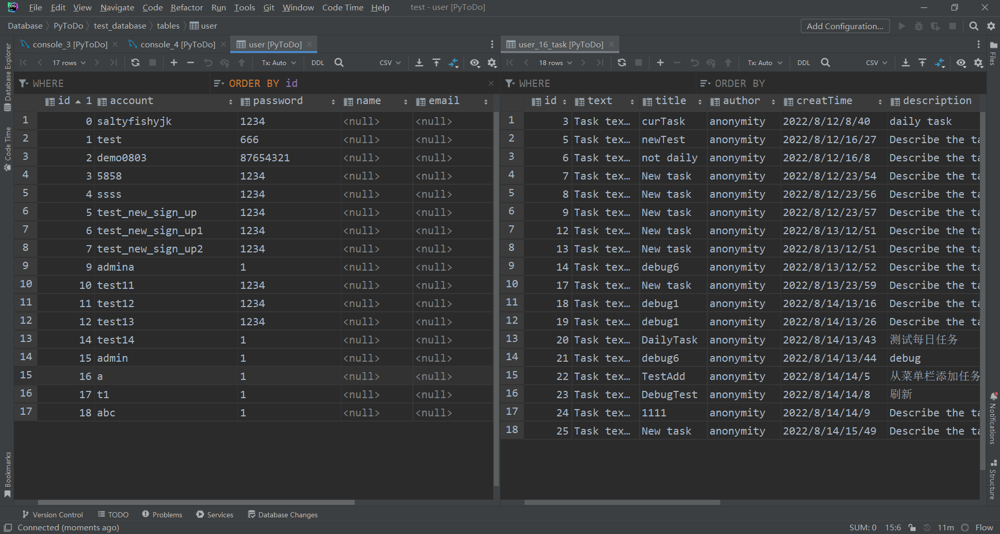
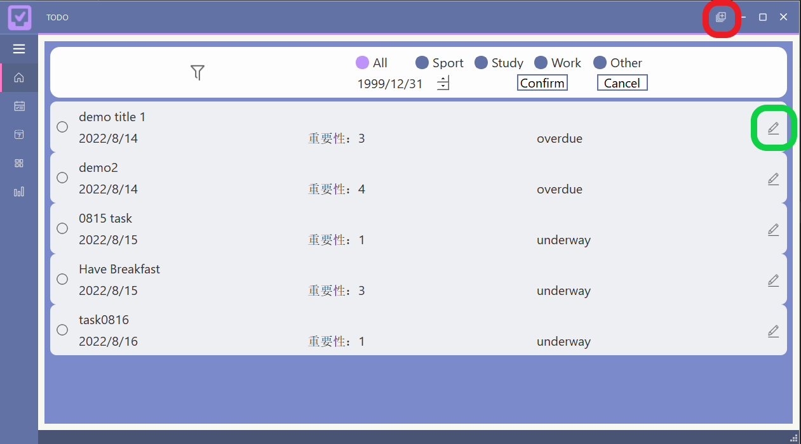
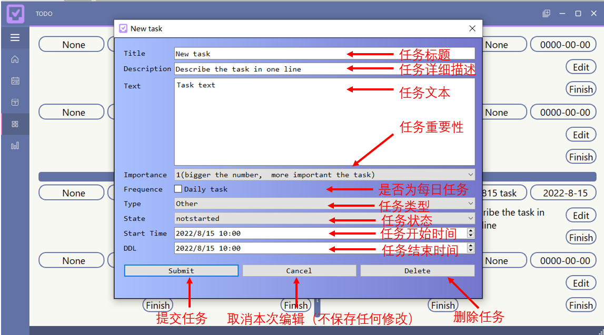
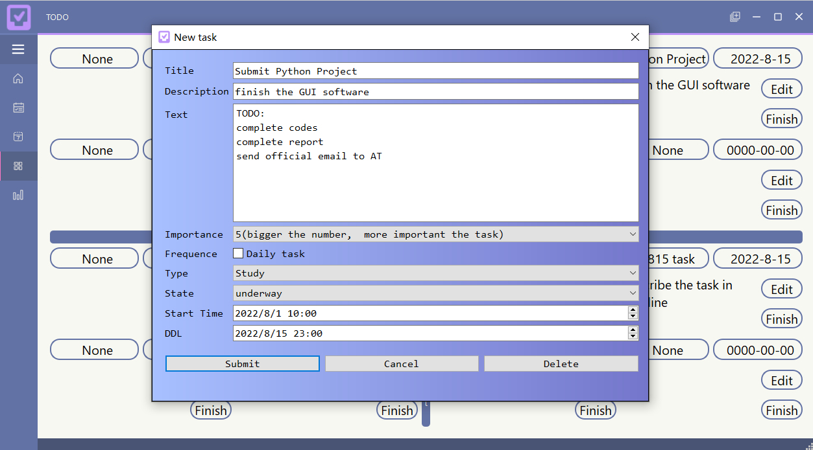
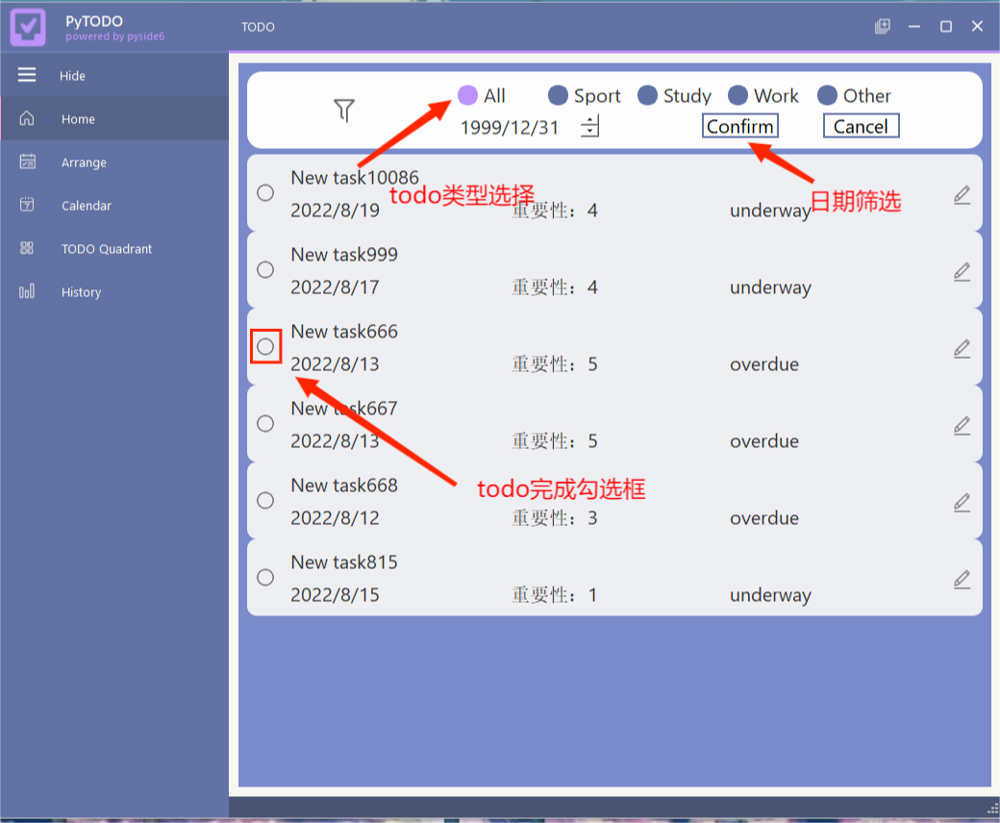
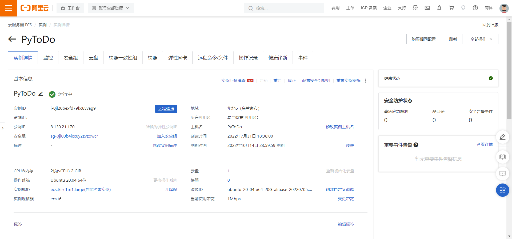
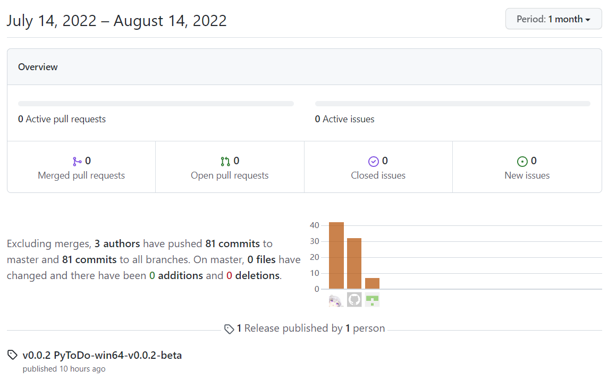

<h1>
    <div align = "center">《暑期Python课》</div>
</h1>

<h1>
    <div align = "center">大作业实验报告</div>
</h1>

<h2>
    <div align = "center">PyToDo——任务调度系统</div>
</h2>


<h4>
    <div align = "center">组号 21</div>
</h4>

<h5>
    <div align = "center">组员1 于敬凯 20373673</div>
</h5>

<h5>
    <div align = "center">组员2 占瑞乙 20373738</div>
</h5>

<h5>
    <div align = "center">组员3 金圣浩 20373795</div>
</h5>


<h6>
    <div align = "center">2022年8月</div>
</h6>
<div STYLE="page-break-after: always;"></div>


## 一、实验任务

题目4 任务调度器

### 内容

随着大学生活日渐丰富，功课和活动更加交织在一起。因此，我们设计了一个应用程序，帮助规划日常任务，合理记录任务，更好地规划自己的时间。

### 要求

1. 使用GUI库，如TKinter和PyQt5
2. 提供一个工作系统，有包括日历、任务状态区分、历史数据审查、任务安排等简洁清晰功能
3. 界面简洁明了而富有表现，用户可以轻松浏览系统


***


## 二、已完成任务

### 基本实验要求 

1. 支持任务添加系统。用户可以创建新任务，包括标题、内容、截止日期、重要性等；同时，任务允许修改和删除。✔
2. 显示每日任务。支持显示每天需要完成的任务。✔
3. 确认任务的完成。当一项任务完成后，用户可以通过勾选复选框等方法标记该任务已完成。✔
4. 日历系统。提供日历，用户可以通过日历查看一个月中每个日期的任务安排。✔
5. 任务状态的区分。区分未开始、进行中、已完成和已逾期四种任务状态。✔
6. 任务安排。通过任务列表，系统自动组织空闲时间安排任务。✔
7. 用户登陆系统。通过架设在服务器的数据库支持用户登陆系统，并通过数据联网支持用户在任何设备上登陆均可同步自己的所有任务。✔

### 可选要求

1. 待办事项系统根据时间过滤和显示任务。✔
2. 任务类别划分。支持体育、学习、工作和其他四种任务类别。✔
3. 数据收集与分析。通过架设在服务器的数据库，系统可以根据历史任务完成数据进行数据分析。✔
4. 支持日常任务。对于日常任务，只需设置一次，就会自动出现在每天指定时间的任务列表中。✔
5. 加权任务安排。支持重要性等属性量化，通过设置任务清单和任务的重要性，可以自动安排任务计划，同时可以分配空闲时间用于休息。✔


***


## 三、整体设计方案

将项目初步解耦为`数据库`、`登录系统`、`任务编辑`、`主页面`四个方面，其中`主页面`又细分为`任务过滤页面`、`任务调度页面`、`日历页面`、`四象限规划页面`、`历史记录可视化页面`。

### 3.1 数据库

考虑到软件的实际应用场景，支持联网的用户登陆系统以及用户数据的保存十分重要。同时，基于用户友好的原则，我们不应当要求使用软件的用户在机器上安装Python环境或者MySQL环境。因此，我们选择了在服务器架设MySQL数据库，以保存每一位用户的信息。

#### PyMySQL

在Python中，PyMySQL库提供了强大的与MySQL数据库交互的方法，基于此，我们针对需求开发了一套较为完整的数据库接口方法作为整个项目的数据后端。

#### 方法与接口

我们实现了以下接口，覆盖了项目需求，完成了数据与业务的解耦。

| 函数方法                     | 功能                             |
| ---------------------------- | -------------------------------- |
| `init_database`              | 数据库连接                       |
| `sign_up_database`           | 数据库端实现注册                 |
| `login_in_database`          | 数据库端实现登录                 |
| `add_task_database`          | 数据库端实现添加任务             |
| `delete_task_databse`        | 数据库端实现删除任务             |
| `modify_task_database`       | 数据库端实现修改任务             |
| `modify_task_state_database` | 数据库端实现修改任务状态         |
| `get_task_list_database`     | 数据库端实现获取当前用户任务列表 |



上图显示了数据库高效组织用户信息。（此为演示页面，不涉及用户隐私）

### 3.2 登录系统

在设计登录系统时，我们采用了大多数软件使用的窗口登录方式——使用单独的窗体进行账户注册与登录，只有在登录成功后才会显示软件主页面。


这里用账户`admin`登录成功后，如下图：


其在主程序中代码如下：

```python
app = QApplication(sys.argv)
loginState, loginuser, tasks=login.loginWindow(app)
window = MainWindow()
if loginState:
sys.exit(app.exec())
else:
sys.exit(1)
```

登录系统作为独立的模块为主程序提供 登录状态(Boolean)、登录用户(User) 和 对应用户存储在数据库中的任务列表(Task[])。

### 3.3 任务编辑

#### 进入编辑界面

在任何页面，都可以通过右上角的新建图标进入新建编辑；同时，在每个页面的相应按钮可以编辑已有任务。下面几张图中红框部分为新建任务，绿框部分为编辑已有任务。




#### 编辑任务

通过上述按钮点按进入编辑界面后，用户不能再与主窗口交互，只有在与任务编辑窗口交互完毕并点按Submit/Cancel/Delete中任意一个后，任务编辑窗口才会自动关闭，这时用户才可以和主窗口继续交互。

对于新建任务，下图展示了新建任务窗口及相应缺省内容：



对于编辑已有任务，下图展示了编辑窗口：



### 3.4 主页面

在主页面中，可以通过左侧选项卡切换至具体页面，在右上角新建任务。


这里，我们在主程序中将主界面各选项卡中的Button控件关联到其对应的页面及相关模块，对任务进行进一步下派：

```python
# LEFT MENUS
widgets.btn_home.clicked.connect(self.buttonClick)
widgets.btn_arrange.clicked.connect(self.buttonClick)
widgets.btn_calendar.clicked.connect(self.buttonClick)
widgets.btn_matrix.clicked.connect(self.buttonClick)
widgets.btn_pic.clicked.connect(self.buttonClick)

def buttonClick(self):
    # GET BUTTON CLICKED
    btn = self.sender()
    btnName = btn.objectName()

    # SHOW HOME PAGE
    if btnName == "btn_home":
    widgets.stackedWidget.setCurrentWidget(widgets.home)
    self.showTodo('All')

    # SHOW WIDGETS PAGE
    if btnName == "btn_arrange":
    widgets.stackedWidget.setCurrentWidget(widgets.arrange_page)
    self.arrange_showList()

    # SHOW CALENDAR PAGE
    if btnName == "btn_calendar":
    widgets.stackedWidget.setCurrentWidget(widgets.calendar_page)  # SET PAGE
    from mycalendar import refresh_calendar
    refresh_calendar()

    # SHOW MATRIX PAGE
    if btnName == "btn_matrix":
    widgets.stackedWidget.setCurrentWidget(widgets.matrix_page)  # SET PAGE
    from mymatrix import matrix_refresh
    matrix_refresh()

    if btnName == "btn_pic":
    widgets.stackedWidget.setCurrentWidget(widgets.pic_page)  # SET PAGE
    from ui_pic import pic_page_refresh
    pic_page_refresh(widgets)

    UIFunctions.resetStyle(self, btnName)  # RESET ANOTHERS BUTTONS SELECTED
    btn.setStyleSheet(UIFunctions.selectMenu(btn.styleSheet()))  # SELECT MENU
```

这样就可以将为每个页面分别撰写的代码（./ui_*.py）拼接在主页面中了。

由login界面登录成功，进入Home界面，Home界面将显示所有未完成的任务；同时也可以根据todo的类型和ddl时间进行筛选，显示特定的任务。在完成任务后，可点击任务框左侧的完成勾选框，任务随即标记已完成并不在home界面中显示



在Arrange界面中，左侧将简要展示所有未完成任务，在右侧可根据自己状态，调整状态参数，由程序动态规划出目前及未来理想待完成任务，实现任务的有序规划。


在日历和四象限页面中，我们采用窗格的形式显示单个任务，将页面布局进行多次纵向、横向划分，从而将单个建模的任务窗格延展到整个页面。在日历中，我们可以通过`Last`和`Next`两个按钮进行月份切换，查看各月份的整体任务情况。


在进行数据分析时，我们使用`matplotlib`库进行数据可视化，将数据库中的数据同步到本地，再对数据进行处理，并拼接所绘制的图片。


***


## 四、创新之处

### 4.1 PySide6 & PyQt6 & PyQt5

我们在完成项目的过程中，以 PySide6 为主体框架，部分细节使用 PyQt5 与 PyQt6 的模块进行实现，整体上实现了多种框架的兼容使用。

### 4.2 时间四象限

我们使使用了由美国管理学家科维提出的时间四象限法进行时间管理，将任务按紧急与重要两个维度进行分类，便于用户做出进一步的时间管理。

具体来说，我们为每个任务设置了重要性作为可选参数，并根据任务的截止时间与当前时间的差距进行紧急性判断，这就是四象限的实现逻辑。用户可以使用界面中的`Edit`与`Finish`按钮来编辑已有任务或占位任务`None`。


### 4.3 数据库与服务器

在数据存储方面，相比于采用本地文本读写或本地MySQL的妥协策略，我们采用了在服务器架设数据库的设计，提供良好的网络服务。下图是本项目的服务器和数据库。




目前，我们的项目已经在数据库端支持用户注册、登录、任务增删改查等功能，而得益于服务器和MySQL数据库的强大能力，我们在后续开发中可以迅速快捷地支持如多人任务、协同编辑、图片服务等。

***


## 五、实验总结

### 5.1 团队开发

为了进行团队共同开发，我们将项目部署在Github上进行管理：[saltyfishyjk/PyToDo: PyToDo is a GUI project based mainly on Python (github.com)](https://github.com/saltyfishyjk/PyToDo)。三人分别在本地进行开发，使用 git 进行版本管理，在 Github 上进行进度同步，大大提高了开发效率。



### 5.2 绘制 GUI

在绘制 GUI 的过程中，我们尝试使用了`QT Designer`图形化生成 GUI 与直接编写代码生成 GUI 这两种方式，前者胜在直观，后者有更高自由度。举例来说，我们在`QT Designer`中拖拽各类控件快速生成像日历这种规整的结构后，将对应的 `.ui` 文件编译成对应的 `.py` 文件后，便可得到相应的 GUI 代码。而在进一步对 GUI 进行美化时，我们使用如 `setStyleSheet`、`appendHtml` 等方法将 CSS、HTML 等样式渲染至我们的 GUI，充分利用 PySide6 较 PyQt5 在渲染速度上的优势进行 GUI 绘制。

### 5.3 页面合并

最初，我们各自完成的页面各有自己的窗体结构及设计风格，如何将其融合进我们的主 GUI 界面成为一大难题。在对 `QMainWindow`的深入理解过程中，我们发现可以将主程序中的窗体看成是一张画布，并将其作为参数传递给各个内容页，这样一来，我们将各自完成的内容页窗体替换至这样一张画布上，便可以避免为每个页面创建单独窗体及应用程序，也就避免了应用程序的唯一性 Bug：

```
QWidget: Must construct a QApplication before a QWidget
```

## 六、课程学习总结

### 理论课与日常作业

本门课程课后作业的难度逐次提升，每次作业中的选填基本覆盖了所有上课涉及的知识点，而前几次的代码作业也通过各类字符串处理的编程题让我们快速熟悉了 Python 的基本语法与一些基本函数；但到了最后几次作业，编程题逐渐演变为算法题，虽然与授课内容略微脱节，但这类算法题也让我们熟练掌握了动态规划、dfs 等基本算法，受益匪浅。

### 大作业

#### 收获

##### Python学习

通过本次大作业项目，我们对Python的了解更深一步，特别是对其解释型语言、胶水语言、面向对象语言的特点了解更深一步。举例而言，在本次项目开发中，我们在各自的操作系统上进行开发（包括macos、Linux和Windows），在各自的python环境中即可运行，即可发布在Windows平台的软件，充分体现了解释型语言一次编写，到处运行的特点；本项目中，我们不仅使用了python基本库，同时使用了包括PyQt，PyMySQL等其他服务为python设计的接口库，充分体现其强兼容性，可以在复杂项目中连接各个模块；同时，我们大量运用了面向对象的知识和技能，极大地方便了团队协同开发，做到了低耦合高内聚，提高了项目的鲁棒性和可扩展性。

##### 团队项目开发与面向对象

本次大作业是我们第一次团队开发（相对）大型项目。在过去的两年中，最大的代码工程是OO中2k行左右的单元作业。而在本次大作业中，我们团队开发了万行以上规模的代码，极大地训练了面向对象的工程能力与项目复杂度控制能力。在这个过程中，我们通过使用Git+GitHub开发，进一步熟悉和掌握现代项目开发的能力。同时，作业过程中对任务进行划分、接口的设计与交互、模块的设计与黑箱等都提升了我们团队合作的能力。

##### 快速学习

在本次大作业开始之前，团队成员Qt, MySQL, Git, 服务器等知识了解不多，但项目开发过程中，基于目的驱动，我们通过各种网络资源快速学习和掌握相关领域基本知识，搭建起了较为完整的系统。

##### 用户导向

在立项之初，我们就以用户真实使用场景和使用体验为项目开发的核心准则，通过问卷收集、走访调查等手段了解大家对于市场类似相关产品的需求与痛点，围绕其展开开发。举例而言，我们在最开始就确定了使用服务器架设数据库的方式进行数据保存，这对用户来说是自然而友好的体验；在新建任务页面，我们为用户最常点选的内容设置了缺省，便利了用户的使用；在主页面，我们设置了任务完成的复选按钮并设计了相关动画，用户体验极佳；在日程安排页面，我们设置了current+next两项任务安排，方便用户集中注意力在最重要的任务上；在日历页面，我们设置了可以查看当月每日任务的功能，方便快捷；在软件状态栏右上方，我们设计了新建任务按钮，方便用户在任意界面新建任务；在数据分析界面，我们绘制了饼图，方便用户直观了解各项数据。

#### 难点

本次大作业最大的难点在于我们使用的 PySide & PyQt 系列的相关学习资料过少，各类论坛上此类框架的使用频率也并不高，因此网络上充斥着大量重复且无用的相关信息，让我们在应对一些未知的 Bug 与兼容性问题时手足无措，对涉及到的一些复杂库函数的学习也只能浅尝辄止。

## 七、主要参考资料

1. [Qt for Python](https://doc.qt.io/qtforpython/)
2. [PyQt5 教程](https://blog.csdn.net/m0_37329910/article/details/86557942)
3. [PyQt5 安装](https://zhuanlan.zhihu.com/p/162866700)
4. [PyQt 中文教程 ](https://maicss.gitbook.io/pyqt-chinese-tutoral/)
5. [学生信息管理系统（一）介绍](https://blog.csdn.net/m0_46315929/article/details/120165424)
6. [学生信息管理系统（一）源码](https://github.com/wuhudasm-lll/-2.0)
7. [学生信息管理系统（二）介绍](https://blog.csdn.net/huchuanwei/article/details/115715016)
8. [PyQt 图形界面编程教学视频](https://www.bilibili.com/video/BV1cJ411R7bP?p=2&vd_source=b0a8793490273b09808dbd6f72d3465c)
9. [PyQt 图形界面编程教学博客](https://www.byhy.net/tut/py/gui/qt_02/)
10. [The Icons](https://fontawesome.com/v3/icons/)
11. [ALi iconfont](https://www.iconfont.cn/collections/index)
